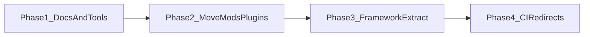

# Monorepo target layout and migration phases

The repository **stays one Git repo**. The goal is **clear boundaries** between framework, mods, plugins, templates, docs, and tooling so users, modders, and contributors can navigate predictably.

## Target topology (directional)

| Top-level | Purpose |
|-----------|---------|
| `framework/` | Core MelonLoader framework (`framework/FrikaMF.csproj`, `framework/FrikaMF/`, entry `Main.cs`) |
| `mods/` | Gameplay mods (`FMF.Mod.*`, `FMF.*.dll` style) |
| `plugins/` | FFM plugins (`FFM.Plugin.*`) |
| `Templates/` | Scaffolds for new mods/plugins |
| `wiki/` | Docusaurus site (product docs; route base `/wiki`) |
| `tools/` | Repo maintenance: hook catalog generator, codegen stubs |
| `scripts/` | Release automation (existing) |

**Binaries**: prefer **GitHub Releases** (and pre-releases for beta) over committing DLLs. See [Release channels](../reference/release-channels.md).

## Phased migration (no big-bang)

| Phase | Scope | Exit criteria |
|-------|--------|---------------|
| **1** | Docs, `tools/`, naming wiki, hook catalog script | Docusaurus build green; script generates catalog |
| **2** | `git mv` former `ModsAndPlugins/` → `mods/` / `plugins/` | Done — `.csproj` relative paths unchanged (depth preserved); CI/docs updated |
| **3** | Framework sources under `framework/` | Done — `FrikaMF.sln` points at `framework\framework/FrikaMF.csproj`; plugins reference `..\..\framework\framework/FrikaMF.csproj` |
| **4** | CI matrix: docs + dotnet; `plugin-client-redirects` for old URLs | PR checks match local workflow |

## Path updates checklist (Phase 2 applied)

- [x] `FrikaMF.sln` project paths (`plugins\FFM.Plugin.*`)
- [x] `.github/workflows` (CodeQL, release assets, Discord feed)
- [x] Contributor docs and mod/plugin wiki pages (`Project Path` lines)
- [ ] [`wiki/docusaurus.config.js`](https://github.com/mleem97/gregFramework/blob/master/wiki/docusaurus.config.js) redirects (only if public URLs must map old paths)
- [ ] Historical wiki-import pages may still mention `StandaloneMods/` — update when editing those files

## Related

- [Repo inventory](./repo-inventory.md)
- [FMF hook naming](../reference/fmf-hook-naming.md)
